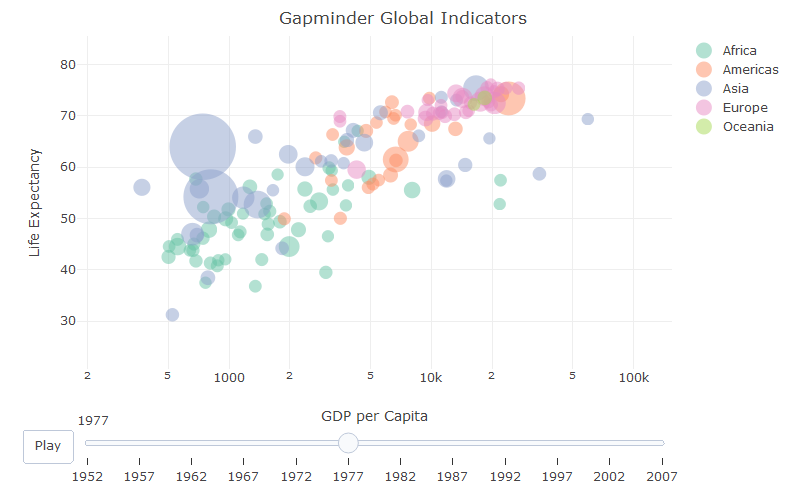

# rbubbly

Represent multiple dimmensional data as a Gapminder-like animated plot

## Getting Started


### Prerequisites

To install this project you will need RStudio (version 1.0.1 or above recommended) and R (version 3.4 or above recommended). Also, you will need to install *plotly* package

```
install.packages("plotly")
```

### Installing

Installation of the project is straightforward using RStudio. Alternativelly, after you build the package archive using RStudio, you can also install the package with the regular R command

````
install.packages("rbubbly")
````

Alternativelly, one can install the package directly from R Console, and without prior download of the package using the command


````
library(devtools)
install_github("gabrielpreda/rbubbly")
````


## Running the tests

To run the tests, you can load the project in RStudio and select *Build*/*Test Package* command from the menu.

## Example of usage

The package includes an example R Markdown example *example/example.Rmd*. This example used *r* package *gapminder* in order to exemplify the usage. You will need to install this package

````
install.packages("gapminder")
````

### Dislay a bubbly plot 

Please make sure you installed the package.


````
#load the package
library(rbubbly)

#load the library gapminder
library(gapminder)

#define the entry parameters for rbubbly
xcolumn = gapminder$gdpPercap
ycolumn = gapminder$lifeExp
bubblecolumn = gapminder$pop
colorcolumn = gapminder$continent
slidercolumn = gapminder$year
textcolumn = gapminder$country

#call the rbubbly function
rbubbly(gapminder, xcolumn, ycolumn,bubblecolumn,colorcolumn,slidercolumn,textcolumn)

````

The following plot will appear.




